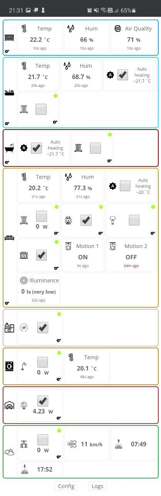
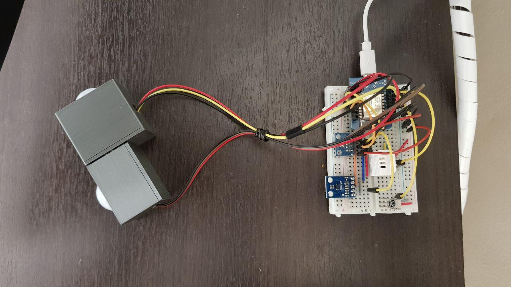

# home-server

A custom server for managing appliances at home using ESP8266-based devices like [Sonoff](http://sonoff.itead.cc/en/) and [Wemos D1 Mini](https://wiki.wemos.cc/products:d1:d1_mini)

_Screenshots_

## Motivation

I bought a bunch of Sonoff devices and decided to upgrade their firmware to [Sonoff-Tasmota](https://github.com/arendst/Sonoff-Tasmota).

By replacing the stock firmware, I can have complete control over the device.
Sonoff-Tasmota uses MQTT as the underlying protocol for communication between a broker and the device.

After using [MQTT Dash](https://play.google.com/store/apps/details?id=net.routix.mqttdash&hl=en) for some time, I decided to build a Progressive Web App.

## Setup

Server runs on a local Raspberry PI model 3 B+ which has the following services:

- [Mosquitto MQTT Broker](https://mosquitto.org/)
- [Redis server](https://redis.io/)

I currently own 6 Sonoff devices, which are connected to the following appliances:

- Patio lamp
- Desk lamp
- Room lamp
- Room heater 1 (this one also reports values from its SI7021 temperature and humidity sensor).
- Room heater 2
- Wall socket

I also have a bunch of sensors connected to a Wemos D1 Mini (flashed with the same firmware above) in my living room:

- [DHT22/AM2301](https://www.sparkfun.com/datasheets/Sensors/Temperature/DHT22.pdf) temperature and humidity sensor
- [HC SR501](https://components101.com/hc-sr501-pir-sensor) PIR motion sensor
- [BMP280](https://components101.com/sensors/bmp180-atmospheric-pressure-sensor) temperature and atmospheric pressure sensor
- [BH1750](https://www.mysensors.org/build/light-bh1750) light level sensor
- Infrared receiver and remote control
- RF transmitter and receiver

## How it works

All devices establish a connection to the MQTT broker and report their state while also subscribing to a control topic, allowing you to switch them on/off.

Server runs as a daemon and subscribes to all sensor topics. Some logic decides when to switch the room heater on/off.

The UI is built on React and consists of simple components that allow the user to switch the appliances on/off and view sensor, weather and derived data, like the "real feel" temperature.

The browser keeps a connection to the MQTT broker over a Websocket.

## What's next?

Not sure, but I recently started playing with electronics and found home-automation to be my new hobby.

I'll keep experimenting with dev boards like Arduino, NodeMCU, ESP8266 and Sonoff devices. They are low cost devices that allows easy customization.

### Possible next projects:

- Automatic plant watering for my garden 🌻
- OLED display screen showing sensor data 📺
- Remote controled car 🚙
